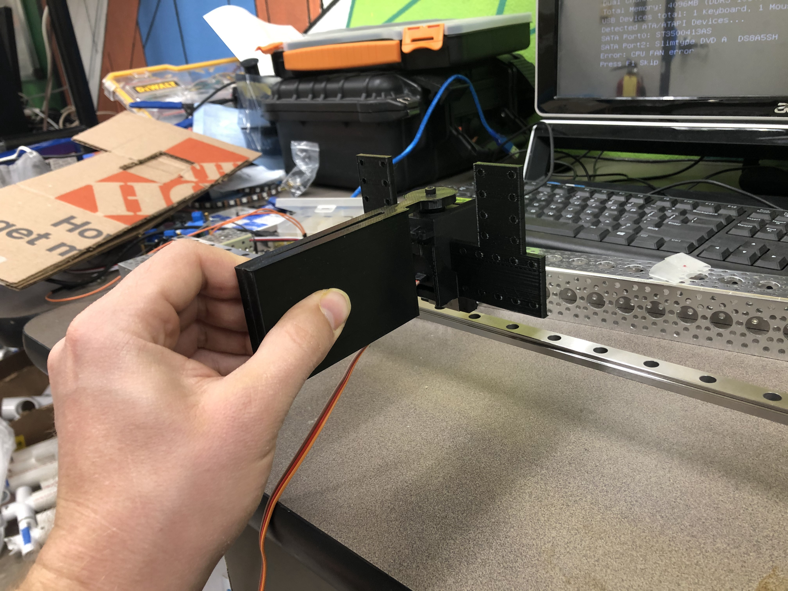
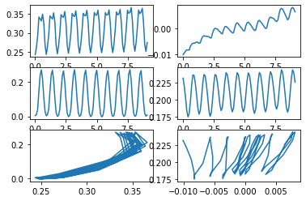
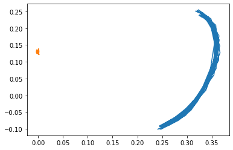

[Return](../../index.md)

```python
import pandas as pd
import numpy as np
import matplotlib.pyplot as plt
import scipy.interpolate as si
import math
from IPython.display import HTML 
from IPython.display import Image

ee1=pd.read_csv(r'Vid1ee.txt', sep=',')
base1=pd.read_csv(r'Vid1Base.txt', sep=',')
ee2=pd.read_csv(r'Vid2ee.txt', sep=',')
base2=pd.read_csv(r'Vid2Base.txt', sep=',')
ee3=pd.read_csv(r'Vid3ee.txt', sep=',')
base3=pd.read_csv(r'Vid3Base.txt', sep=',')
ee4=pd.read_csv(r'Vid4ee.txt', sep=',')
base4=pd.read_csv(r'Vid4Base.txt', sep=',')
ee5=pd.read_csv(r'Vid5ee.txt', sep=',')
base5=pd.read_csv(r'Vid5Base.txt', sep=',')
ee6=pd.read_csv(r'Vid6ee.txt', sep=',')
base6=pd.read_csv(r'Vid6Base.txt', sep=',')
ee7=pd.read_csv(r'Vid7ee.txt', sep=',')
base7=pd.read_csv(r'Vid7Base.txt', sep=',')
ee8=pd.read_csv(r'Vid8ee.txt', sep=',')
base8=pd.read_csv(r'Vid8Base.txt', sep=',')
#ee9=pd.read_csv(r'E:\OneDrive - Arizona State University\Spring 2021\EGR 557 Foldable Robotics\Data collection\Vid9ee.txt', sep=',')
#base9=pd.read_csv(r'E:\OneDrive - Arizona State University\Spring 2021\EGR 557 Foldable Robotics\Data collection\Vid9Base.txt', sep=',')

```


```python
def extract_plot(ee,base,amplitude,freq,vshift):
    x2 = ee.x.to_numpy()
    y2 = ee.y.to_numpy()
    t2 = ee.t.to_numpy()

    x2b = base.x.to_numpy()
    y2b = base.y.to_numpy()
    t2b = base.t.to_numpy()
    
    theta = np.r_[0:t2[-1]*1000:1]
    out = vshift + amplitude*np.sin(theta*freq)*180/np.pi


    xy2 = np.array([x2,y2]).T
    xy2b = np.array([x2b,y2b]).T

    XYee2 = si.interp1d(t2,xy2.T,fill_value='extrapolate',kind='quadratic')
    XYbase2 = si.interp1d(t2,xy2b.T,fill_value='extrapolate',kind='quadratic')
    new_t2 = np.r_[0:t2[-1]:.1]

    avg2 = np.mean(XYbase2(new_t2)[0])
    Xee2 = (XYee2(new_t2)[0]-avg2)*-1
    Xbase2 = (XYbase2(new_t2)[0]-avg2)*-1
    
    height = XYbase2(new_t2)[1][-1]- XYbase2(new_t2)[1][0]
    Vel = height/new_t2[-1]

    fig1, axs = plt.subplots(3,2)
    #plt.plot(t,x)
    axs[0,0].plot(new_t2,Xee2)
    axs[0,1].plot(new_t2,Xbase2)

    #plt.plot(t,y)
    axs[1,0].plot(new_t2,XYee2(new_t2)[1])
    axs[1,1].plot(new_t2,XYbase2(new_t2)[1])

    axs[2,0].plot(Xee2,XYee2(new_t2)[1])
    axs[2,1].plot(Xbase2,XYbase2(new_t2)[1])

    plt.figure()
    plt.plot(Xee2,XYee2(new_t2)[1])
    plt.plot(Xbase2,XYbase2(new_t2)[1])
    
    plt.figure()
    plt.plot(theta/1000,out)
    
    print(height)
    print(Vel)
```

# Setup


```python
Image(filename='setup1.jpg') 
```


    

    


```python
Image(filename='setup2.jpg') 
```


    

    


```python
 Image(filename='setup3.jpg') 
```


    

    


```python
Image(filename='setup4.jpg')
```


    

    


# Videos and Plotted expiremental data
*Note data is mirrored to help better match the dynamic code


```python
amp = np.deg2rad(45)
vshift = 110
freq = 0.005

extract_plot(ee6,base6,amp,freq,vshift)
```

    0.18155234989999983
    0.019733951076086935
    


<video width="320" height="480" controls>
  <source src="Vid6.mp4" type="video/mp4">
</video>

[Video 1](Vid.mp4)


    

    


    

    


    

    


```python
amp = np.deg2rad(45)
vshift = 110
freq = 0.007

extract_plot(ee3,base3,amp,freq,vshift)
```

    0.15047987119999984
    0.012972402689655157
    


<video width="320" height="480" controls>
  <source src="Vid3.mp4" type="video/mp4">
</video>


    

    


    

    


    

    


```python
amp = np.deg2rad(45)
vshift = 90
freq=0.007
extract_plot(ee2,base2,amp,freq,vshift)
```

    -0.005773203300000029
    -0.0006344179450549483
    


<video width="320" height="480" controls>
  <source src="Vid2.mp4" type="video/mp4">
</video>


    

    


    

    


    

    


```python
amp = np.deg2rad(45)
vshift = 100
freq = 0.005

extract_plot(ee4,base4,amp,freq,vshift)
```

    0.0009551232000000187
    8.452417699115209e-05
    


<video width="320" height="480" controls>
  <source src="Vid4.mp4" type="video/mp4">
</video>


    

    


    

    


    

    


```python
x2 = ee6.x.to_numpy()
y2 = ee6.y.to_numpy()
t2 = ee6.t.to_numpy()

x2b = base6.x.to_numpy()
y2b = base6.y.to_numpy()
t2b = base6.t.to_numpy()


xy2 = np.array([x2,y2]).T
xy2b = np.array([x2b,y2b]).T

XYee2 = si.interp1d(t2,xy2.T,fill_value='extrapolate',kind='quadratic')
XYbase2 = si.interp1d(t2,xy2b.T,fill_value='extrapolate',kind='quadratic')
new_t2 = np.r_[0:t2[-1]:.1]

avg2 = np.mean(XYbase2(new_t2)[0])
Xee2 = (XYee2(new_t2)[0]-avg2)*-1
Xbase2 = (XYbase2(new_t2)[0]-avg2)*-1
    
height = XYbase2(new_t2)[1][-1]- XYbase2(new_t2)[1][0]
Vel = height/new_t2[-1]

plt.figure()
plt.plot(new_t2,XYbase2(new_t2)[1]*100)
plt.xlim([0,1.3])
plt.ylim([23,30])


```


    (23.0, 30.0)


    

    


 

# Video Comparison


<video width="320" height="480" controls>
  <source src="Vid6.mp4" type="video/mp4">
</video>


# Discussion

1. What do you consider the top five sources of error in your data collection experiment?
    1. Unstable Mounting Design
        Prior to collecting data, we conducted a test run of our cardboard bird wing using the same railing as above but a less sturdy mounting design. This “mount” design was stabilized with a few tiny bolts unevenly distributed through a smaller piece of the metal used for the railing originally. This lack of stability resulted in the wrong moving inconsistently in both forward and backward directions. 
    2. Sinusoidal Input 
        For programming, a sinusoidal input was created and uploaded through an Arduino to program the wing. This input had the following sinusoidal format:
        A * sin(Bt + C) + D
        Based on the math, we did not have a need for a C value, but the rest we did. The B value is a reflection of speed, and if this value is too slow or too fast, the wing may be seen as reading incorrect information. Knowing which exact values were best took a while, and resulted in multiple runs of the wing moving too slowly to drive any sort of thrust. 
        Based on the math we calculated, there was no need for a C value. However the best values for our wing’s motion was determined to be A = 45 (amplitude/ range of motion in degrees of the servo), B = 0.007 * milliseconds clock on Arduino (speed), and D = 110 (the offset and length of downward thrust). 
        - 45 degrees,  15cm 0.01s 
        - 110 farther downward thrust and faster flapping frequency
        - Too low of a theta = no positive created thrust
        - Too fast, full rotation was just barely met
    3. Hyperextension of bottom joint -due to manufacturing process
        The bottom link of the wing is supposed to be limited to 180 degrees during the downstroke and tuck during the upstroke. The upper link is supposed to be slightly bent, pointing into the direction of travel during both strokes. In the video, there are some unwanted inversions of the links that do not match this desired geometry.
    4. Stiffness of roller (friction)
        The rail that the cart is mounted on has very low friction, but there is some friction adding additional damping along the direction of travel.
    5. Camera Angle
        The camera is not perfectly perpendicular to the plane that the wing moves in, and the camera is slightly shaky since we did not have a mount.


2. What steps did you take to reduce the error?
    1. Our original rail mount had a lot of play, so we redesigned the mount to reduce the error from wobbling
    2. Based on the math we calculated, there was no need for a C value. However the best values for our wing’s motion was determined to be A = 45 (amplitude/ range of motion in degrees of the servo), B = 0.007 * milliseconds clock on Arduino (speed), and D = 110 (the offset and length of downward thrust). 
    3. Our original wing design did not include the angle limiter on the lower link. We considered the possibility of inversions and added the limiter to make the joint stiffer during the downstroke, but even with the angle limiter, the cardboard is not stiff enough and inverts.
    4. Our original plan was to 3D print an actual cart with plastic wheels and mount the wing to that cart. We realized that would have a lot of friction and switched to this metal rail and cart with bearings to reduce friction
    5. We did not have a good way to mount the camera, but we tried to hold the camera as perpendicular to the wing’s plane and at a consistent height so that the scaling of the image was as consistent as possible


3. What was difficult to control?
    
    It was most difficult to control the inversion of the wing. This wing has two degrees of freedom, but we are only actuating one base link. We are relying on the dynamics of the wing including its joint stiffness and damping and the aerodynamic forces to extend and tuck the wing through the stroke. We cannot directly control the geometry of the wing.


4. How would you improve your testing setup or procedure next time?
    
    To improve the accuracy of the data next time, we would like to use a fixed camera mount with a perfectly perpendicular perspective. Additionally, we would like to use a better mount that connects the wing top the motor to better transmit the torque to the wing.


5. How well does your data mirror your simulated results? What is similar, what is different?
    
    The data generally matches the simulated result. In the hardware test, the position of the base advances slowly after each flap. The simulation also shows a positive displacement after one full flap. The simulator has slightly greater displacement than the hardware test. The angles achieved by each link throughout the motion are slightly different between the hardware test and the simulation, but overall, the wing is more extended during the downstroke of both and tucked more during the upstroke of both


6. Is it possible to add a modeling element which models/captures discrepancies between these two results? What element if added to your simulation has the biggest impact on its fidelity?
    
    To capture some of the discrepancies between the simulation and the hardware test, we could model the rolling resistance of the rail, the position control of the servo, and the multiple flaps.


7. What additional equations and parameters would you need in order to add this element?
    1. Rolling resistance of the rail
        There is friction between the rolling wing and the linear rail. We could model this friction as a damping force against the direction of travel as function of the base link’s linear velocity.
    2. Position Control
        The dynamic simulation uses a torque control while the hardware test uses a position control. We tried to make them as similar as possible by applying a consistent torque equal to the constant torque output of the servo and timing the steps of the servo with the switching time of the simulation. However, we could convert the simulation to position control to better represent the hardware by adding the position control as an angle constraint on the actuated link instead of a torque input.
    3. Multiple Flaps
        Our simulation only performs one flap while the hardware test performs multiple. To make them as similar as possible, we made the timing of the flaps, and the initial and final angles of the stroke in both the simulation and the hardware test as similar as possible. We assume in the simulation that there is a perfect loop after the stroke, but there is a slight jump at the end of the stroke while the hardware test is smoother. We would have to add more step functions that change the values for every single variable that switches with respect to time. This includes the motor torque, the angle limiter stiffness, and the aerodynamic forces on the 6 links. We would have to add 16 step functions per flap since it switches at the top and bottom of the stroke for 8 variables.


[Return](../../index.md)