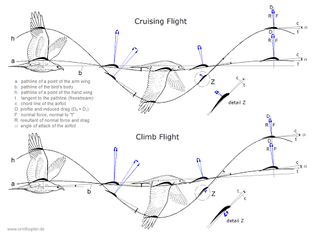
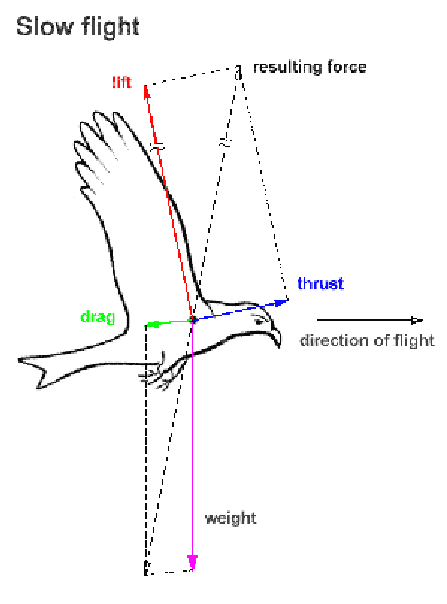
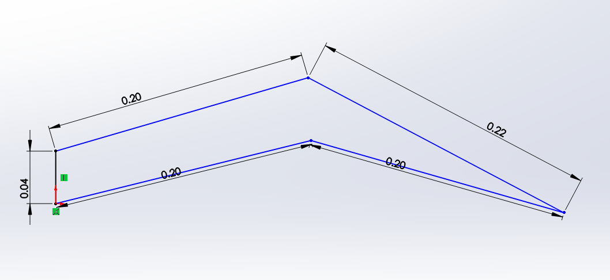

#
# Duck Biomechanics Background and Initial Specifications

Team 3: BIRB (Biodegradable Inspired Robotic Bird)

Chris Breaux, George Muhn, Lien White

##

[HOME](index.md)

## Candidate Organism

Our candidate organism is the mallard duck _anas platyrhynchos_ [1].

1. **List five of the most closely related research references on topics pertinent to your project, in IEEE format.** Identify three citations which are most useful in creating initial specifications for your robot.

  1. \* [All About Mallard Ducks](https://www.allaboutbirds.org/guide/Mallard/id) [2]
  2. \*[Wingbeat Frequency and Flap-Pause Ratio During Natural Migratory Flight in Thrushes](https://academic.oup.com/icb/article/48/1/134/627446) [3]
  3. \*[Kinematics and Mechanic of Ground Take-off in the Starling Sturnis Vulgaris and the Quail Coturnix Coturnix](https://jeb.biologists.org/content/jexbio/203/4/725.full.pdf) [4]
  4. [WING DESIGN AND MIGRATORY FLIGHT](https://brill.com/view/journals/ijee/41/3/article-p297_11.xml) [5]
  5. [Avian Wing Geometry and Kinematics](https://arc.aiaa.org/doi/abs/10.2514/1.16224?casa_token=r6aivCuGqMgAAAAA%3Ap7HvCTCPssW98Qedh3qjCwQa3h6oTVcNZ6BCSFze0NS6uCvBZKfUV_2CfwQQ2x-zJE9muAHnl9A&amp;) [6]

[2] describes the specifics of the mallard duck including its general size, habitats, behaviors, color patterns and more. This source gave us the information we needed to determine what kinds of lengths we may want to replicate. The average wingspan of a mallard duck for both females and males is about between 32.2-37.4 in, which would make each wing anywear from 16.1 to 19.7 inches. This is what will guide our wing radius and chord length specifications for our foldable wing.

[3] analyzes the frequency and flap-pause ration that occurs in birds like the mallard duck. The study analyzed flap frequency at an initial take-off, cruise, and descent phase. On average in all three phases the typical flapping frequency was between 9.5 and 11.5 Hz. It may be difficult to replicate this fast of a frequency in the scope of our robot, but knowing that a successful robotic replication of a migratory bird would need a flap frequency of this range give us an idea of what maximum frequency the team could work towards achieving.

[4] takes a starling and quail to observe the kinematics and mechanics behind how they launch themselves for take-off. The research shows force diagrams of these birds at different times frames within the take-off phase, and uses that information to create graphs relating a bird&#39;s body angle vs. time, vertical vs. horizontal positions of the bird&#39;s body, and so on. This paper is a great source of reference for when it comes to the building of the team&#39;s kinematics, and could be a comparison tool for the motion we create.

**Existing Bio-Inspired Robots**

1. **List five of the most closely-related research references on topics pertinent to your project in IEEE format. Identify three citations which are most useful in creating initial specifications for your robot.**
  1. **\*** [SmartBird](https://www.festo.com/net/SupportPortal/Files/448580/SmartBird_ICAS%202012%20scientific%20pub%20Festo%20layout_en.pdf) [7]
  2. \*[Bionic Flying-Fox](https://www.festo.com/PDF_Flip/corp/Festo_BionicFlyingFox/en/) [8]
  3. \*[Feathered Tail and Pygostyle for the Flying Control of a Bio-Mimicking Eagle Bird Robot](https://ieeexplore-ieee-org.ezproxy1.lib.asu.edu/stamp/stamp.jsp?tp=&amp;arnumber=8274837)[9]
  4. [The thrust and lift of an ornithopter&#39;s membrane wings with simple flapping motion](https://reader.elsevier.com/reader/sd/pii/S1270963805001525?token=AC6A516DAC3D36C0E59CED1BAA7ED2B8158F07A8D1FE717619E5D7CE6D0791EDC7A62C033F9AF1B83E692A95931E1671) [10]
  5. [A Review of Bird-Inspired Flapping Wing Miniature Air Vehicle Designs](https://asmedigitalcollection.asme.org/mechanismsrobotics/article/4/2/021003/467462/A-Review-of-Bird-Inspired-Flapping-Wing-Miniature?casa_token=c5PzwYWw17YAAAAA:UmvjFGqweXSziV64nsa-dp4rKSCdZuaAVCB2onmIVPmbWOg_PFQKodPfANDSzyYBH3dH7_Nr) [11]

[7] focuses on the SmartBird, which was built by the Festo company. This article in particular showcases the torsion and partial linear kinematics that were tested, displaying the wing&#39;s geometric properties and force diagram while in flight. The article also addressed how power was designed and connected to the wing&#39;s functionality, which helped the team better understand how our wing may fold in relation to a servo and how much power may be consumed with our wing. This helped us set up the necessary specifications for our flap ROM, flap frequency, and power consumption calculations.

[8] explains the design of another Festo robot, the flying fox or a bat. The biomechanics of a bat are different than that of a mallard duck, however there was some inspiration we could draw from the mechanics of the bat&#39;s wings. The wingspan was very similar to that of the mallard duck&#39;s based on the information from source [1] which helped us validate the general range of wing span and radius we want to accomplish. This bat also has a total weight of 580 grams, which we noticed is similar to the weight of a typical flying UAV [12]. Knowing this, we determined that achieving a total robotic weight of about 500 grams would be ideal for our duck robot.

[9] details the design behind an eagle bird robot, specifically it&#39;s tail feather layout. The authors show a visual diagram of the roll and yaw motion the tail of an eagle actuates, and displayed where motors can be best placed to replicate these actuations. This helped us better understand how our servo or actuator choice may be placed with respect to the vertical motion of our desired wing. The tail is made up of individual feathers that bend together under certain actuations, which help our team better visualize the potential folds that our duck wing may have.

**Specifications Table**

| **Parameter** | **Unit** | **Value Range** | **Ideal Value** | **Reference** |
| --- | --- | --- | --- | --- |
| Wing Radius | meters | 0.3-0.5 | 0.4 | [2] |
| Chord Length | meters | 0.1-0.3 | 0.2 | [2] |
| Flap Frequency | Hertz | 1-5 | 2 | [7] |
| Robot Mass | grams | 250-750 | \*500 | [12] |
| Flap ROM | degrees | 0-90 | 45 | [7] |
| E.E Force | N | 5-10 | \*\*9.81 | [4] |
| Power Consumption | Watts | 0-25 | \*\*\*23 | [7] |

\*Based on typical FPV Drone specifications [12]

\*\*End-effector force = 2 \* (0.5kg \* 9.81m/s^2) = 9.81 N

\*\*\*Power = [0.2 \* (0.115, 0.256)kg \* 9.81m/s^2 \* 1.3m/s] = 0.293 - 0.653 watts

**Figures of Biological System**

Figure 1. Cruising flight force diagrams of migratory birds [15]

Figure 2. Force diagram layout of a bird [16]

**Simple Engineering Representation**

Figure 3. 5-bar mechanism wing design in Solidworks. Two inputs and single output at the tip of the wing.

## **Discussion**

1. **Discuss / defend your rationale for the size animal you selected in terms of your ability to replicate key features remotely with limited material selection.**

The average mallard duck is between 1000-1300 grams [2]. This is on the heavier end of the spectrum. However a typical flying UAV is about 500 grams. If we were to replicate a life size mallard duck, then there&#39;s a chance we create a robot that is too heavy to fly. This is why we decided to make our bird-bot the size of a small mallard duck at around 500 grams total. This would also not require a lot of material or a very large footprint in comparison to the size of a typically mallard duck, so it will be relatively easy to reproduce. The size of the animal is not too large or too small to be built by disposable materials, or use typical actuators and power sources based on the bio-inspired flying robots created by Festo and other researchers.

1. **Find a motor and battery that can supply the mechanical power needs obtained above.** _Consider that motor efficiencies may be as high as 95%, but if you can&#39;t find it listed, assume you find a more affordable motor at 50-70% efficiency. Compare the mechanical watts/kg for the necessary motor and battery vs the animal&#39;s mechanical power/mass above? Which one is more energy dense?_

A 150:1 micrometal gear motor [13] and battery [14] that could fit our specifications for creating a bird like robot. This motor is small, light and produces a good amount of torque for our desired outcome. The battery is also small and light but would require a second battery in series to obtain the correct voltage for the motors. The batteries would also provide enough amp hours to power 1 motor for 2.6 hours at max current efficiency and power 3 motors for 55min at max efficiency. A drawback is the max efficiency of the motor is 33%. For power rating output power for the motor at max efficiency is 0.3 Watts. This would provide a watts/kg ratio of 31.78 watt/kg, for purely the motor. This is more than enough to power our wing.

##

## **References**

[1]&quot;Mallard,&quot; _Wikipedia_, 19-Feb-2021. [Online]. Available: https://en.wikipedia.org/wiki/Mallard. [Accessed: 28-Feb-2021].

[2] &quot;Mallard Identification, All About Birds, Cornell Lab of Ornithology,&quot; _, All About Birds, Cornell Lab of Ornithology_, 2019. [Online]. Available: https://www.allaboutbirds.org/guide/Mallard/id. [Accessed: 28-Feb-2021].

[3] W. W. Cochran, M. S. Bowlin, and M. Wikelski, &quot;Wingbeat frequency and flap-pause ratio during natural migratory flight in thrushes,&quot; _OUP Academic_, 02-Jun-2008. [Online]. Available: https://academic.oup.com/icb/article/48/1/134/627446. [Accessed: 28-Feb-2021].

[4] K. D. Earls, &quot;Kinematics and mechanics of ground take-off in the starling Sturnis vulgaris and the quail Coturnix coturnix,&quot; _Journal of Experimental Biology_, 15-Feb-2000. [Online]. Available: https://jeb.biologists.org/content/203/4/725. [Accessed: 28-Feb-2021].

[5] U. M. Norberg, &quot;WING DESIGN AND MIGRATORY FLIGHT,&quot; _Brill_, 12-Apr-1995. [Online]. Available: https://brill.com/view/journals/ijee/41/3/article-p297\_11.xml. [Accessed: 28-Feb-2021].

[6] T. Liu, W. M. University, K. Kuykendoll, N. A. S. A. L. R. Center, R. Rhew, S. Jones, C. Harvey, J. P. Calogero, K. Kitamura, K. Kitamura, Gavin K. Ananda and Michael S. Selig, D. Kumar, M. Hamdaoui, S. Klän, Pradeep Gopalakrishnan and Danesh K. Tafti, J. T. Black, C. Svanberg, S. Pantula, J. Jackson, R. Unger, S. Bansmer, and W. L. S. Pantula, &quot;Avian Wing Geometry and Kinematics,&quot; _AIAA Journal_, 02-May-2012. [Online]. Available: https://arc.aiaa.org/doi/abs/10.2514/1.16224?casa\_token=r6aivCuGqMgAAAAA%3Ap7HvCTCPssW98Qedh3qjCwQa3h6oTVcNZ6BCSFze0NS6uCvBZKfUV\_2CfwQQ2x-zJE9muAHnl9A&amp;. [Accessed: 28-Feb-2021].

[7] Send, W. &amp; Fischer, M. &amp; Jebens, K. &amp; Mugrauer, R. &amp; Nagarathinam, A. &amp; Scharstein, F.. (2012). Artificial hinged-wing bird with active torsion and partially linear kinematics. 28th Congress of the International Council of the Aeronautical Sciences 2012, ICAS 2012. 2. 1148-1157.

[8] &quot;Festo Bionic Flying Fox,&quot; _Pneumatic &amp; electric automation technology_, Mar-2018. [Online]. Available: https://www.festo.com/PDF\_Flip/corp/Festo\_BionicFlyingFox/en/. [Accessed: 28-Feb-2021].

[9] F. Nickols and Y. J. Lin, &quot;Feathered tail and pygostyle for the flying control of a bio-mimicking eagle bird robot,&quot; 2017 IEEE International Conference on Cybernetics and Intelligent Systems (CIS) and IEEE Conference on Robotics, Automation and Mechatronics (RAM), Ningbo, China, 2017, pp. 556-561, doi: 10.1109/ICCIS.2017.8274837.

[10] C.-S. Lin, C. Hwu, and W.-B. Young, &quot;The thrust and lift of an ornithopter&#39;s membrane wings with simple flapping motion,&quot; _Aerospace Science and Technology_, 01-Dec-2005. [Online]. Available: https://www.sciencedirect.com/science/article/abs/pii/S1270963805001525. [Accessed: 28-Feb-2021].

[11] J. W. Gerdes, S. K. Gupta, and S. A. Wilkerson, &quot;A Review of Bird-Inspired Flapping Wing Miniature Air Vehicle Designs,&quot; _Journal of Mechanisms and Robotics_, 01-May-2012. [Online]. Available: https://asmedigitalcollection.asme.org/mechanismsrobotics/article-abstract/4/2/021003/467462/A-Review-of-Bird-Inspired-Flapping-Wing-Miniature?redirectedFrom=fulltext. [Accessed: 28-Feb-2021].

[12] &quot;BEGINNERS FPV DRONE GUIDE,&quot; Custom Quads. [Online]. Available: https://customquads.com.au/pages/fpv-beginners-start-here#:~:text=To%20build%20a%20standard%20FPV,800%20grams%20with%20a%20battery. [Accessed: 28-Feb-2021].

[13] &quot;Pololu - 150:1 Micro Metal Gearmotor MP 6V,&quot; _Pololu Robotics &amp; Electronics_. [Online]. Available: https://www.pololu.com/product/2368/specs. [Accessed: 07-Feb-2021].

[14] &quot;AKZYTUE 3.7V 400mAh 802525 Lipo Battery Rechargeable Lithium Polymer ion Battery Pack with JST Connector,&quot; _Amazon.com_. [Online]. Available: https://www.amazon.com/AKZYTUE-Battery-Rechargeable-Lithium-Connector/dp/B07TVDNQNS/ref=sr\_1\_2?dchild=1&amp;keywords=3.7V+400mAh+Lithium+Polymer&amp;qid=1612665237&amp;s=hpc&amp;sr=1-2. [Accessed: 06-Feb-2021].

[15] T. Allen and Y. Tavares, &quot;Planes and Birds: Minimizing Energy,&quot; _Santa Fe College_, 2018. [Online]. Available: https://www.sfcollege.edu/Assets/sf/rue/pdfs/2017/allen.pdf. [Accessed: 28-Feb-2021].

[16] Caramin, Bénédicte &amp; Dunn, Iain &amp; Ney, Rauno &amp; Klawikowski, Yvonne &amp; Duarte, Abel &amp; Malheiro, Benedita &amp; Ribeiro, Cristina &amp; Ferreira, Fernando &amp; Silva, Manuel &amp; Ferreira, Paulo &amp; Guedes, Pedro. (2015). Design and Implementation of a Biologically Inspired Flying Robot - An EPS@ISEP 2014 Spring Project. 10.1145/2808580.2808612.

[HOME](index.md)