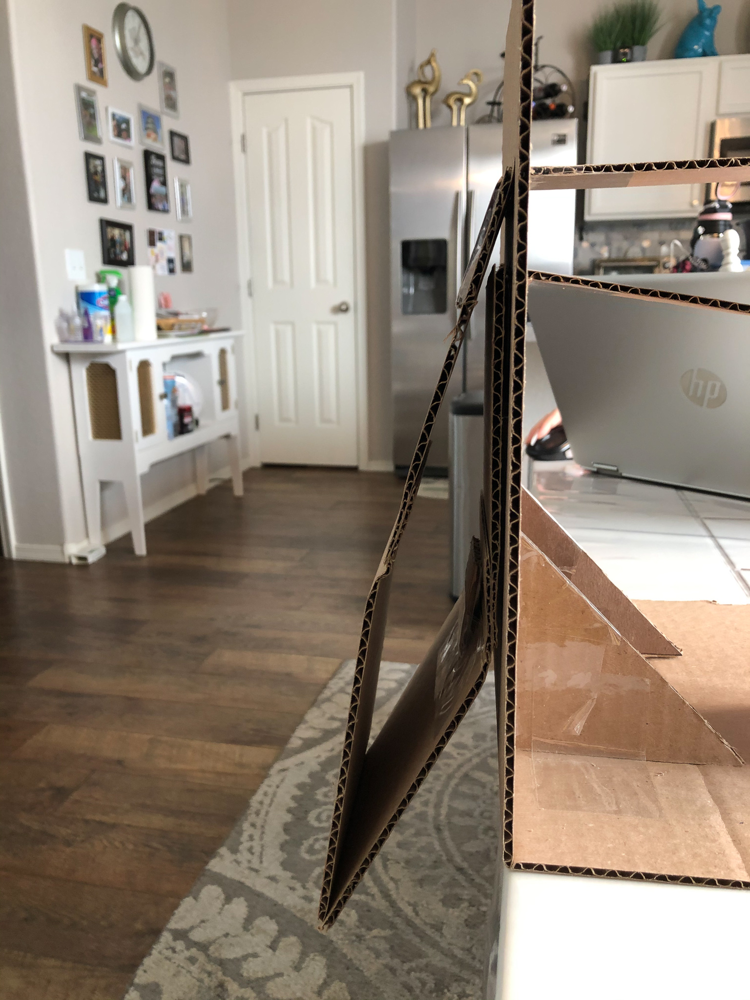

Dynamics II

_Team 3: B.I.R.B_

_Chris Breaux, George Muhn, and Lien White_

Please see: [Jupyter Notebook](https://nbviewer.jupyter.org/url/biodegradablerobotics.github.io/Code/System%20Dynamics%202%20FINAL.ipynb)

[Dynamics](dynamics.html)

# **Parameterization**

1. **Force and Power Analysis**

Using Solidworks, the team created the following model of a wing, built with a small tab on the bottom link as an angle-limiting constraint to our mechanism (Figure 1.).

_Figure 1. Wing force diagram at the end effector, or the tip._

1. **Weight of Links**

Density of Cardboard (d) = 0.501kg/(1.27\*0.6604\*0.004)m = 149 kg/m³

Barea = 0.3m \*0.15m \* 0.004m = 1.8\*10^-4 m³

Tarea= 0.33m \*0.15m\* 0.004m = 1.98\*10^-4 m³

WBottom = Barea \* d = 1.8\*(10^-4) m³ \* 149 kg/m³ \* 1000 g = 26.82 g

WTop = Barea \* d = 1.98\*(10^-4) m³ \* 149 kg/m³ \* 1000 g = 29.502 g

TotalW = WBottom + WTop = 26.82 g + 29.502 g = 56.32 g

  1. **Force of End Effector (E.E.)**

FE.E. = 2 \* (0.05632kg \* 9.81m/s²) = 1.105 N

We want our E.E. to support double the wing&#39;s weight, which explains the additional multiplication by 2 in our force equation.

  1. **Desired Velocity of E.E.**

Arcwing = (45° \* π/180° \* 0.4m \* 2arc) = 0.6283 radians

VE.E. (min) = 1Hz \* Arcwing = 0.6283 m/s

VE.E. (ideal) = 2Hz \* Arcwing = 1.257 m/s

VE.E. (max) = 5Hz \* Arcwing = 3.142 m/s

Range: 0.6283 - 3.142 m/s

The minimum, ideal, and maximum velocities are dependent upon the herz or flapping frequency we decided in our specifications table.

  1. **Power of E.E.**

Power (min) = FE.E. \* VE.E. (min) = 1.105 N \* 0.6283 m/s = 0.6943 Watts

Power (ideal) = FE.E. \* VE.E. (ideal) = 1.105 N \* 1.257 m/s = 1.389 Watts

Power (max) = FE.E. \* VE.E. (max) = 1.105 N \* 3.142 m/s = 3.472 Watts

Range: 0.6943- 3.472 Watts

These calculations are well in the range of power consumption we hope to achieve. The smaller the value the better, and based on these calculations the wing will require a power consumption less than our ideal value, which is excellent news.

  1. **Torque**

T = 2.227 Nm

This was determined based on the kinematics model the team made previously.

1. **Joint Stiffness &amp; Damping Analysis**

_Figure 2. Tracker video_

The Stiffness and damping Analysis failed to produce results as the optimization function took 24+ hours to run without completing or identifying a valid solution. To accommodate the dynamic python model was evaluated visually and determined b and k values that resulted in the closest simulation to the video taken.

_Figure 3. Tracker data_

1. **Link Stiffness Analysis**

_Figure 4. Cantilever beam test_

Using a battery with a known weight and using multiple of them for different steps of weight. Then using the Euler-Bernoulli Equations and measured deflection caused by the force at the point. We were able to determine the YOung&#39;s Modulus with the equation below.

1. **Motor Selection and Specifications**
  1. **Torque**

T = 2.227 N\*m

  1. **Power**

P: 0.6943- 3.472 Watts

  1. **Ounce-Inch Force**

Watts Conversion = 1260 - 6301 oz-in

  1. **No Load RPM**

RPM(min) = 1Hz \* 60 sec \* 2 = 120 RPM

RPM(ideal) = 2Hz \* 60 sec \* 2 = 240 RPM

RPM(max) = 5Hz \* 60 sec \* 2 = 600 RPM

No Load RPM = 120 RPM - 600RPM

  1. **Seconds/60°**

60 RPM = 1 rev/sec

1 sec/rev = 1/60 RPM

120 RPM = 2 rev/sec = 0.5 sec/rev = 0.5/6 sec/60° or 0.08333 sec/60°

600 RPM = 10 rev/sec = 0.2 sec/rev = 0.2/6 sec/60° or 0.03333 sec/60°

Range: 0.3333-0.8333 sec/60°

  1. **Weight**

Specification Goal: 250-750 grams

After Wing Weight : 193.7 - 693.7 grams

_Table 1. Servomotor Component Selection_

| **Specification** | **Ideal** | [**Servo 1**](https://www.servocity.com/sg12-series-servo-gearbox-5-1-ratio-640-rotation-1750-oz-in-0-80-sec-60/) | [**Servo 2**](https://www.servocity.com/sg12-series-servo-gearbox-3-8-1-ratio-640-rotation-1330-oz-in-0-61-sec-60/) | [**Servo 3**](https://www.servocity.com/sg12-series-servo-gearbox-3-1-ratio-640-rotation-1050-oz-in-0-48-sec-60/) |
| --- | --- | --- | --- | --- |
| Torque (N\*m) | _2.227_ | 8.474 - 12.36 | 6.440 - 9.392 | 5.084 - 7.415 |
| Power (W) | _0.9319- 4.660_ | 0.8873 - 1.294 | 0.6744 - 0.9835 | 0.5324 - 0.7765 |
| No-Load RPM | _120 - 600_ | / | / | / |
| oz-inch | _1260 - 6301_
 | 1200 -1750 | 912 - 1330 | 720 -1050 |
| sec/60° | _0.3333-0.8333_ | 0.8 -1.25 | 0.61 - 0.95 | 0.48 - 0.75 |
| Weight (g) | _193.7 - 693.7_ | 194 | 195 | 195 |
| Cost ($) | _\&lt;100_ | 0 | 119.99 | 119.99 |
| **RANKING** | 1 | 2 | 3 |

**Rationale:** Based on these three servos, we have decided to move forward with Servo 1. This choice does have a voltage rating way higher than we need, however it has the closest power rating and oz-inch rating that we will need. Each choice is above the price range the team hoped to spend, but Servo 1 happened to be already accessible to the team via previous project by one of the members, making it a cost efficient choice as well.

1. **Power Selection and Specifications**

Based on the servo the team has selected, the necessary power the wing will need must fall within the specifications of Servo 1. This is shown in the &quot;Ideal&quot; column of Table 2, where we also benchmark a few batteries that may be best for our biodegradable wing design. After benchmarking, we decided to use Battery 2.

_Table 2. Power Supply Selection_

| **Specification** | **Ideal** | [**Battery 1**](https://www.amazon.com/EBL-Rechargeable-Batteries-Lithium-4-Packs/dp/B00EJKIDHE) | [**Battery 2**](https://www.amazon.com/Duracell-Coppertop-Alkaline-Batteries-Count/dp/B000K2NW08/ref=asc_df_B000K2NW08/?tag=&amp;linkCode=df0&amp;hvadid=385286500718&amp;hvpos=&amp;hvnetw=g&amp;hvrand=16239690689066539954&amp;hvpone=&amp;hvptwo=&amp;hvqmt=&amp;hvdev=c&amp;hvdvcmdl=&amp;hvlocint=&amp;hvlocphy=9031300&amp;hvtargid=pla-827864912627&amp;ref=&amp;adgrpid=84171693088&amp;th=1) | [**Battery 3**](https://www.amazon.com/Energizer-Ultimate-Lithium-Batteries-2-Count/dp/B01684J7P0) |
| --- | --- | --- | --- | --- |
| Voltage (V) | _4.8V - 7.4_ | 9 | 9 | 9 |
| Current (mAH) | _\&lt; 1800_ | 600 | 310 | 1000 (max) |
| Material | _Lithium Ion_ | Lithium Ion | Alkaline | Lithium |
| Weight (g) | _\&lt;500_ | 28.35 | 23 | 100 |
| Cost/Battery ($) | _\&lt;15_ | 4.25 | 2.80 | 7.19 |
| **RANKING** | 2 | 1 | 3 |

**Rationale:** Based on our power selection, we have decided to use the Alkaline battery (Battery 2). For the project scope, it has the lightest weight and is the most cost efficient. However, if selecting a battery for outdoor and reusable use, Battery 1 would be the best choice to follow through with. Battery 1 is also made with Lithium Ion, which is better for the environment if the wings were to be used with the intent of being disposable and biodegradable.

# **Simulation**

1. **Assumptions**

While our material parameterization optimization was running endlessly, we used a set of assumptions for our model. These are placeholder estimates that should be near the actual values and produce a desirable motion until they can be replaced with the parameterization results.

E = 844.45 MPa [1]

kbase = 1e-4, kjoint = 1e-3, kbend = 6, klim = 3, bbase = 1e-2, bjoint = 1e-2

The Young&#39;s modulus for cardboard from [1] was used to calculate the virtual joint stiffness from the pseudo-rigid-body model using the code in [2]. &quot;Kbend&quot; and &quot;klim&quot; are the stiffnesses of virtual joints based on Euler-Bernoulli equations from the course module on pseudo rigid body modeling. &quot;Kbend&quot; is the virtual joint stiffness of the two compliant links. &quot;Klim&quot; is the virtual joint stiffness of the angle limiter. &quot;Kbase&quot; is the estimated value for the stiffness of taped joints connected to the base. &quot;Kjoint&quot;is the estimated value for the stiffness of the free joints. &quot;Bbase&quot; is the estimated value for the joint damping for the taped joints connected to the base. &quot;Bjoint&quot; is the estimated value for the joint damping for the free joints.

1. **Constraints and Valid Initial Condition**

Two constraints and a set of initial joint values were used to determine the valid initial condition in Figure 5. The first constraint connects the ends of the two two-bar mechanisms that form the wing tip. The second constraint aligns links A and B to form the fully extended wing position. The set of initial angles were measured from the SolidWorks model when qA = 45 which results in the fully extended wing position at the top of its stroke seen in the figure. An optimizer minimizes the two constraints beginning with the initial condition to determine the true values near that position.

_Figure 5. Free body diagram of wings and its reference frames._

1. **Aerodynamic Forces**

A simplified model of the flat plate aerodynamic forces like the figure below is applied to the links in the simulation. The velocity of each link&#39;s center of mass is evaluated, along with the angle of attack and the effective area. The drag force is applied at the center of mass of the link.

_Figure 6. Flat plate aerodynamics_

1. **Motion**

The flapping motion of the wing primarily depends on the time-varying torque input and the angle limiting tab in the bottom arm. The wing starts in a fully extended position pointing 45 degrees up (measured from the bottom arm). Initially, the motor applies a negative torque, and the joint with the angle limiter, being engaged at 180 degrees, acts like a very stiff virtual joint. At the bottom of the stroke, at the critical time step, the torque reverses to begin the upstroke. At this point, the angle limiter becomes disengaged and reverts to the less stiff, normal joint stiffness.

[_Figure_](https://github.com/biodegradablerobotics/biodegradablerobotics.github.io/blob/main/Images/Dyn2%20flap.gif)_7 Wing in full motion._

1. **Energy**

The wing with no actuation can be evaluated with respect to its kinetic energy output. In the graph below, we see that if the wing is released from the highest height it can reach, it will quickly fall down due to gravity and reach zero kinetic energy (Figure 8.) A visual of the wing dropping from this high point is shown in the animation in Figure 8.

_Figure 8. system energy (y-axis) over time (x-axis) evaluation with no actuation_

[_Figure_](https://github.com/biodegradablerobotics/biodegradablerobotics.github.io/blob/main/Images/sad.gif)_9. Wing with no actuation coming to zero._

# **Prototype**

Our prototype is again made with C-flute cardboard, which is typical 4mm thick cardboard. We constructed it by cutting four individual links and attached them together with clear tape. The wing is upheld on a cardboard mount constructed with the same cardboard type. Taped onto the B link, or the bottom link that directly connects to the wing tip, is a smaller square piece for cardboard meant to act as a constraint for on the wing as it transitions between different phases (shown in Figures 10-13 below).

 

_Figure 10. Wing at highest constrained point. Figure 11. Wing at lowest constrained point._

 

_Figure 12. Wing partially bent on uprise. Figure 13. Wing at position zero._

# **References**

[1] Zoheir Aboura, Nabil Talbi, Samir Allaoui, Malk Benzeggagh. Elastic behavior of corrugated cardboard: Experiments and Modeling. Composite Structures, Elsevier, 2004, 63 (1), pp.53-62. Ffhal00636959

[2] [https://nbviewer.jupyter.org/url/biodegradablerobotics.github.io/Code/VirtualJoint.ipynb](https://nbviewer.jupyter.org/url/biodegradablerobotics.github.io/Code/VirtualJoint.ipynb)