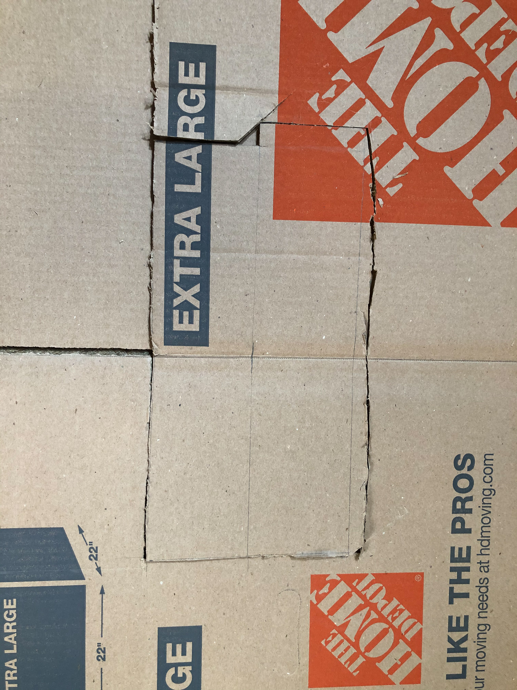
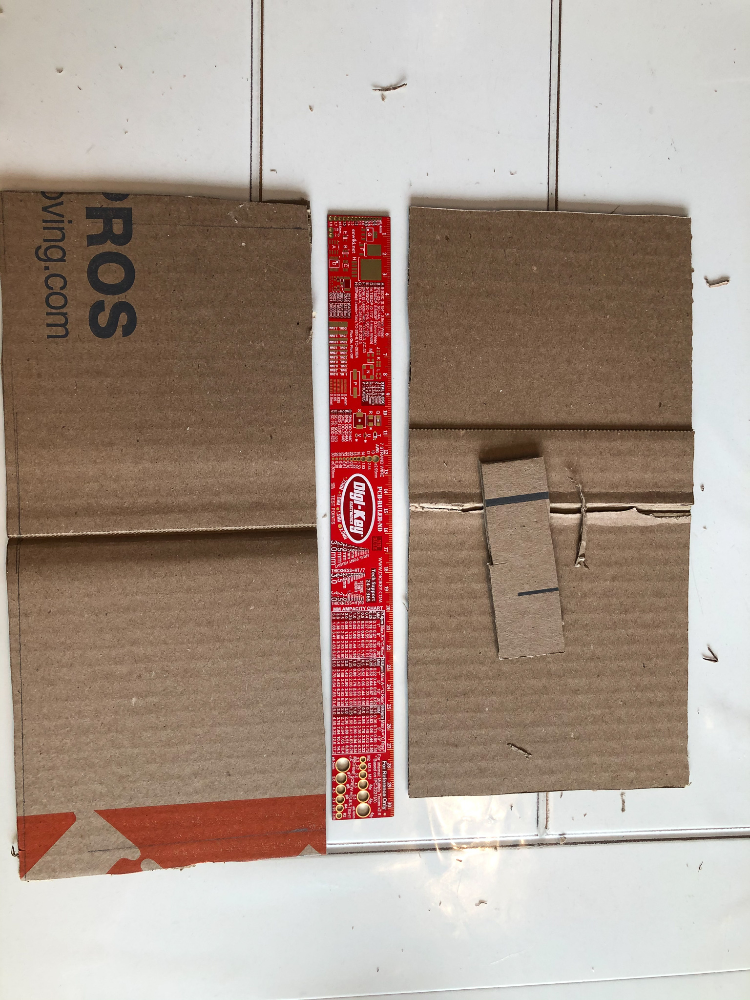
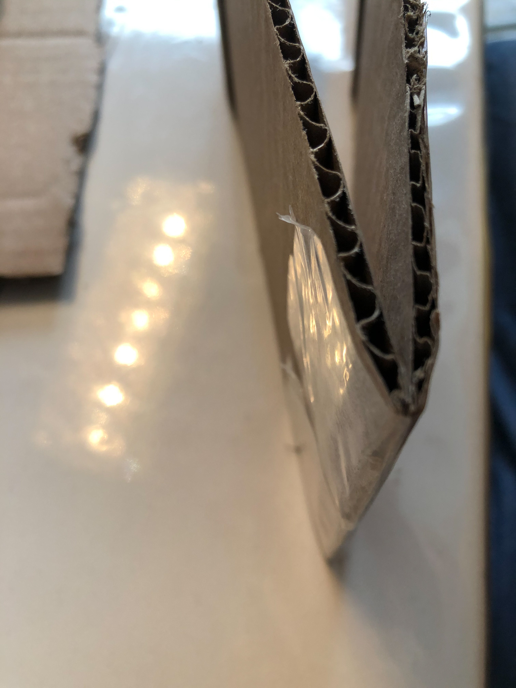
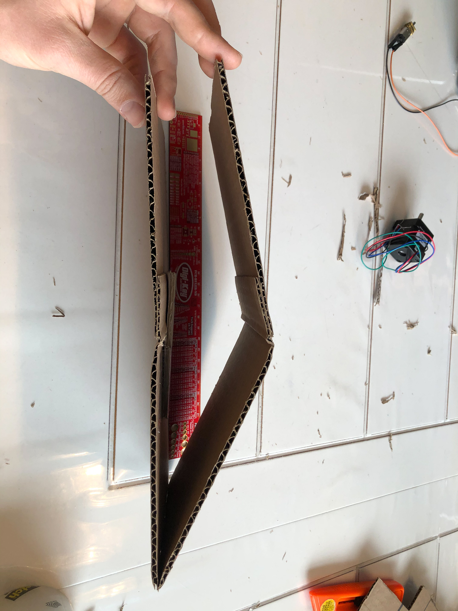
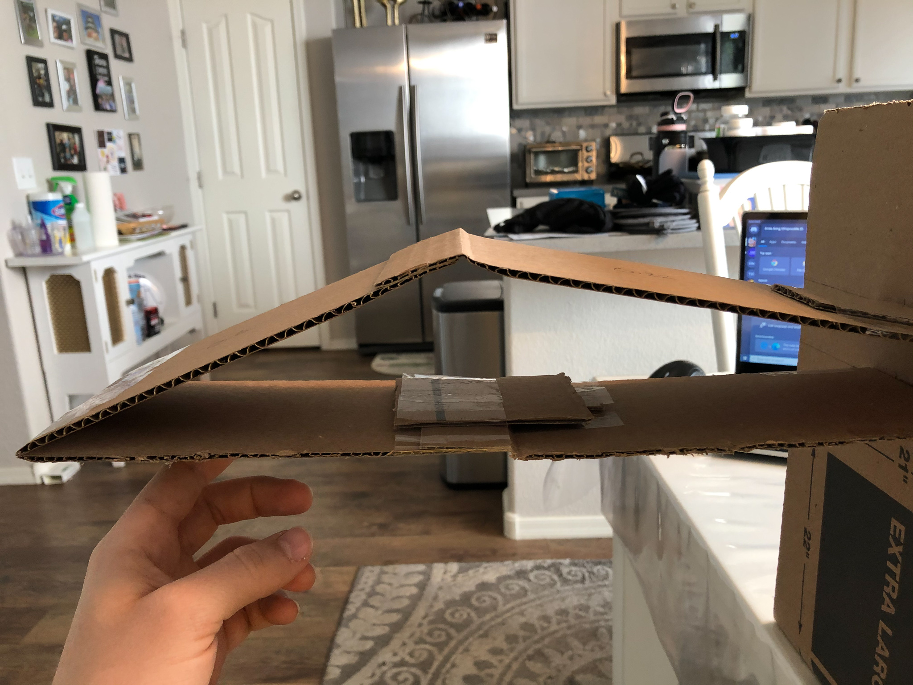
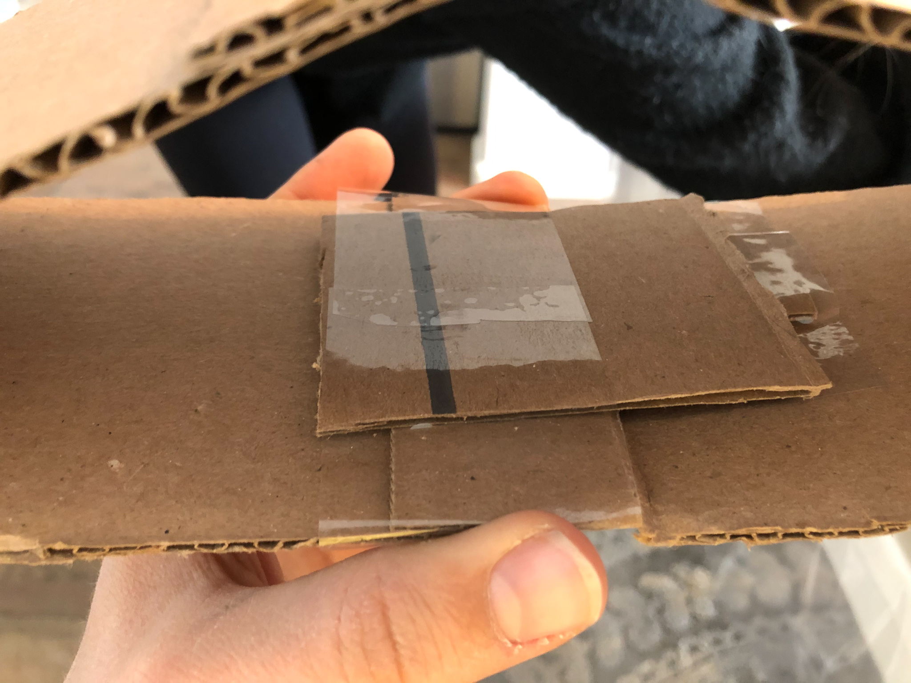
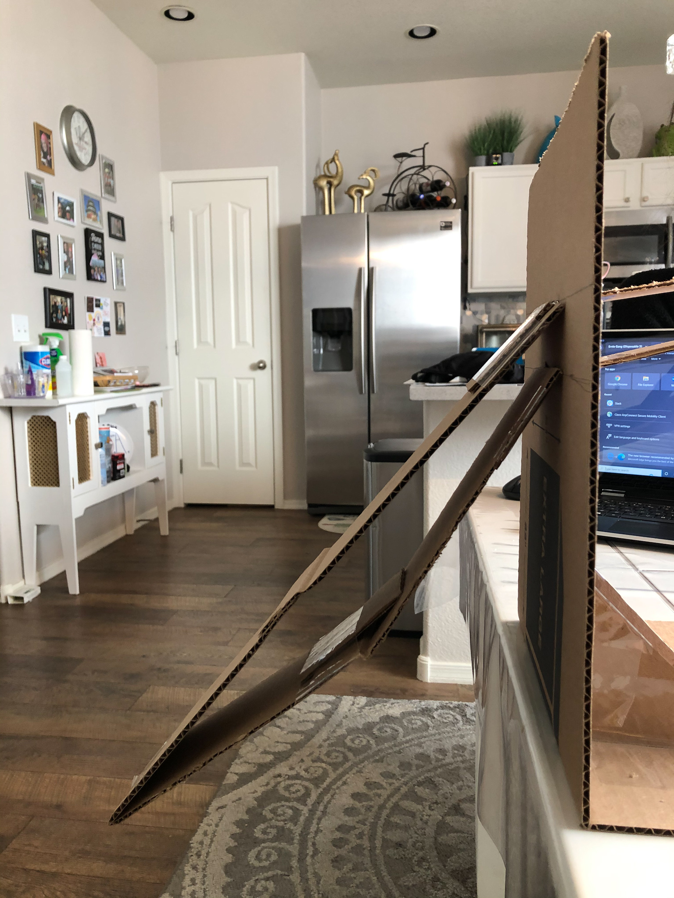
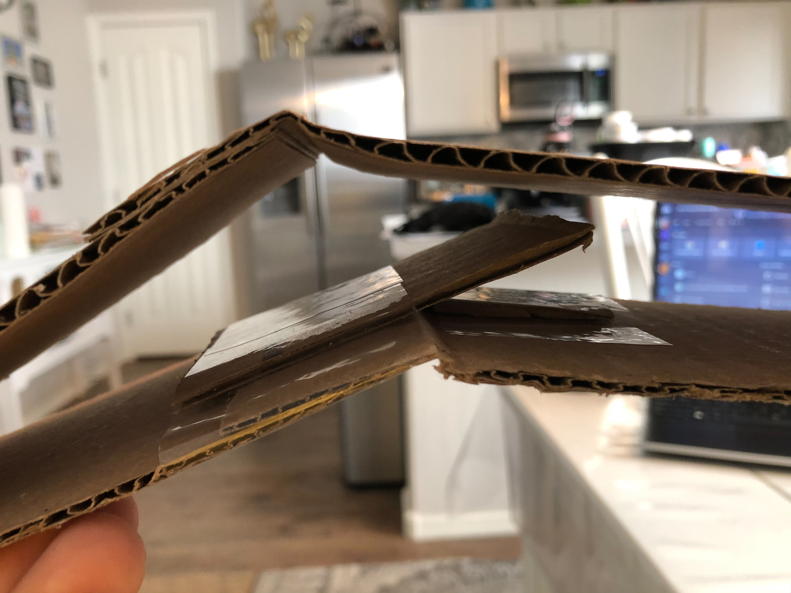
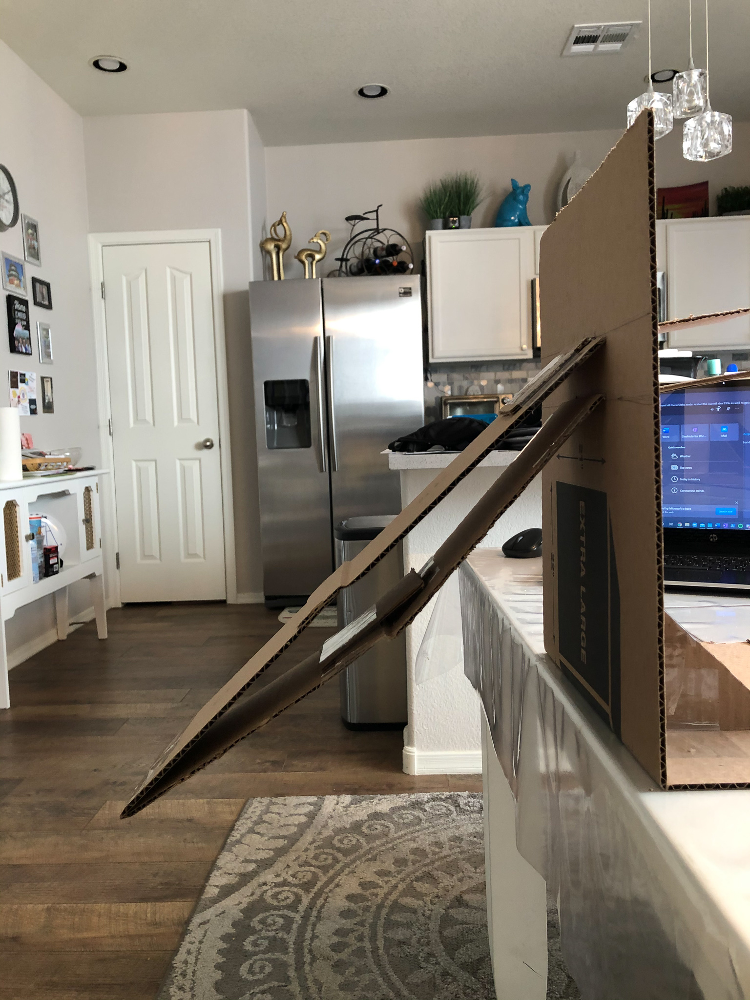

# Material Collection and Initial Prototyping

By George Muhn

## Selecting a Material

After conducting research and completing the system kinematics assignment, the team was able to put together a list of key specifications that we would look for in identifying the material as well as the construction process. The team identified three potential materials that could be used for creating a first prototype: Cardstock, Cardboard, Balsa Wood. The materials were then compared using _table 1_ to rank each material with the respective specification. General specifications were used and a rating of low, medium and high were used as rankings.

| Material | Light weight | Stiffness | Easily create joints | Cheap | Biodegradable/ recyclable | Strength |
| --- | --- | --- | --- | --- | --- | --- |
| Cardstock | High | Low | High | High | High | Low |
| Cardboard | High | medium | High | High | High | medium |
| Balsa Wood | High | High | low | High | High | High |

_Table 1: Ranking materials to general specifications_

Through the process the only material that was rejected was cardstock. Its low stiffness and Strength would not be sufficient for the robotic wing&#39;s structure. Therefore the best two options were cardboard and balsa wood. For this assignment and the first prototype, cardboard was chosen. Cardboard has the ability to be bent, cut, and taped to form joints easily, it is cheap and found easily at many stores, and it is great for recycling. [1] Most likely a balsa wood prototype will be constructed later for comparison.

## Prototyping

For prototyping the general steps were documented using pictures. While using cardboard, bending and taping were the primary uses of assembly. We also identified the weight using the density of cardboard and its volume.

Density of cardboard [2]:

Weight of prototype one:

Weight of prototype two:

Density of balsa wood [3]:

Weight of prototype one:

Weight of prototype two:

## 1st Iteration:

Step 1: Draw the outline of both bottom and top part of the wing using the already existing crease to act as a joint.

Top part dimensions: 42 cm x 10 cm.

Bottom part dimensions: 40 cm x 10 cm.

Attached at base: 4cm apart

Step 2: Cut out to exact dimensions specified above.

Step 3: Using tape, join the tip of the wing together.

 

Step 3: Created a stand to which the wing could be mounted. Also added an angle limiting piece on the inside of the bottom wing. This is to prevent the wing to bend back when flapping down.

 

Step 4: attempting different motions and positions with it

  

## Evaluation 1:

While building and assembling the 1st iteration of the prototype a few imperfections were observed and some improvements needed to be made. The motion of the wing was more limited than what was hoped for, the wing was unable to fold in as much as desired. At this time teammate Chris identified a solution for this problem while working on the solidworks design. The overall system would be sized down and the proportion of the lengths changing.

Top part dimensions: 33 cm x 10 cm.

Bottom part dimensions: 30 cm x 10 cm.

Attached at base: 4.5 cm apart

With these changes a new iteration was designed and prototype built using the same steps as shown above.

## Iteration 2

##     

## Evaluation 2:

After updating the prototype with the new dimensions the prototype&#39;s motion was immensely better. On the down stroke the wing easily stayed straight and outstretched. On the up stroke the wing was able to bend much tighter which will allow for less drag.

## Future Actions

Along with the wing a testing stand was built in order to easily mount the wing and capture its motion. The next steps are to take a few videos of the prototype in motion to identify its natural damping and spring constants. This will be accomplished using the tracker software.

## Bibliography

[1] &quot;Recycling Cardboard - RecyclingWorks,&quot; _RecyclingWorks Massachusetts_, 16-Sep-2020. [Online]. Available: https://recyclingworksma.com/how-to/materials-guidance/recycling-cardboard/#:~:text=Cardboard%2C%20also%20referred%20to%20as,is%20collected%20in%20your%20facility. [Accessed: 08-Mar-2021].

[2] &quot;Density of Cardboard in 285 units of density,&quot; _Density of Cardboard_. [Online].Available:https://www.aqua-calc.com/page/density-table/substance/cardboard#:~:text=Cardboard%20weighs%200.689%20gram%20per,inch%20%5Boz%2Finch%C2%B3%5D%20. [Accessed: 08-Mar-2021].

[3] M. Borrega, P. Ahvenainen, R. Serimaa, and L. Gibson, &quot;Composition and structure of balsa (Ochroma pyramidale) wood,&quot; _Wood Science and Technology_, vol. 49, no. 2, pp. 403–420, 2015.