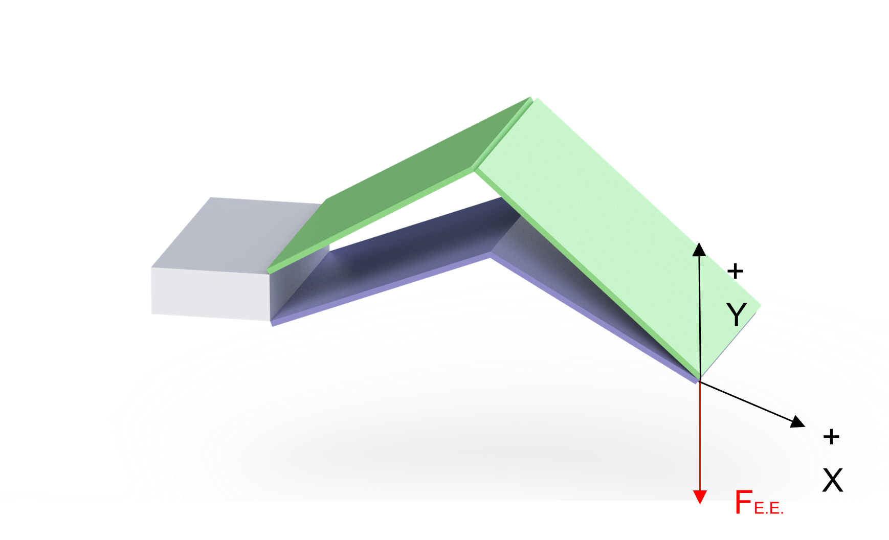

Servo Actuator Parameter Analysis

*Team 3: B.I.R.B*

*Lien White*

1. **Force and Power Analysis**

*Figure 1. Wing force diagram at the end effector, or the tip.* 

1. **Weight of Links**

Density of Cardboard (d) = 0.501kg/(1.27\*0.6604\*0.004)m = 149 kg/m³

Barea = 0.3m \*0.15m \* 0.004m = 1.8\*10^-4 m³

Tarea= 0.33m \*0.15m\* 0.004m = 1.98\*10^-4 m³

WBottom = Barea \* d = 1.8\*(10^-4) m³ \* 149 kg/m³ \* 1000 g =  26.82 g

WTop = Barea \* d = 1.98\*(10^-4) m³ \* 149 kg/m³ \* 1000 g = 29.502 g

TotalW = WBottom + WTop = 26.82 g + 29.502 g = 56.32 g

2. **Force of End Effector (E.E.)**

FE.E. = 2 \* (0.05632kg \* 9.81m/s²) = 1.105 N

We want our E.E. to support double the wing’s weight, which explains the additional multiplication by 2 in our force equation.

3. **Desired Velocity of E.E.**

Arcwing = (45° \* π/180° \* 0.4m \* 2arc) = 0.6283 radians

VE.E. (min) = 1Hz \* Arcwing = 0.6283 m/s

VE.E. (ideal) = 2Hz \* Arcwing = 1.257 m/s

VE.E. (max) = 5Hz \* Arcwing = 3.142 m/s

Range: 0.6283 - 3.142 m/s

The minimum, ideal, and maximum velocities are dependent upon the herz or flapping frequency we decided in our specifications table. 

4. **Power of E.E.**

Power (min) =  FE.E. \* VE.E. (min) = 1.105 N \* 0.6283 m/s  = 0.6943 Watts

Power (ideal) = FE.E. \* VE.E. (ideal) = 1.105 N \* 1.257 m/s = 1.389 Watts

Power (max) = FE.E. \* VE.E. (max) = 1.105 N \* 3.142 m/s = 3.472 Watts

Range:  0.6943- 3.472 Watts

These calculations are well in the range of power consumption we hope to achieve. The smaller the value the better, and based on these calculations the wing will require a power consumption less than our ideal value, which is excellent news. 

5. **Torque**

T = 2.227 Nm

This was determined based on the kinematics model the team made previously. 

1. **Ideal Motor Specifications**
1. **Torque**

` `T = 2.227 N\*m

2. **Power**

P:  0.6943- 3.472 Watts

3. **Ounce-Inch Force**

Watts Conversion = 1260 - 6301 oz-in

4. **No Load RPM**

RPM(min) = 1Hz \* 60 sec \* 2 = 120 RPM

RPM(ideal) = 2Hz \* 60 sec \* 2 = 240 RPM

RPM(max) = 5Hz \* 60 sec \* 2 = 600 RPM

No Load RPM = 120 RPM - 600RPM

5. **Seconds/60°**

60 RPM = 1 rev/sec

1 sec/rev = 1/60 RPM

120 RPM = 2 rev/sec = 0.5 sec/rev = 0.5/6 sec/60° or 0.08333 sec/60° 

600 RPM = 10 rev/sec = 0.2 sec/rev = 0.2/6 sec/60° or 0.03333 sec/60°

Range: 0.3333-0.8333 sec/60°

6. **Weight** 

Specification Goal: 250-750 grams 

After Wing Weight: 193.7 - 693.7 grams

*Table 1. Servomotor Component Selection*

|**Specification**|**Ideal**|[**Servo 1**](https://www.servocity.com/sg12-series-servo-gearbox-5-1-ratio-640-rotation-1750-oz-in-0-80-sec-60/)|[**Servo 2**](https://www.servocity.com/sg12-series-servo-gearbox-3-8-1-ratio-640-rotation-1330-oz-in-0-61-sec-60/)|[**Servo 3**](https://www.servocity.com/sg12-series-servo-gearbox-3-1-ratio-640-rotation-1050-oz-in-0-48-sec-60/)|
| :-: | :-: | :-: | :-: | :-: |
|Torque (N\*m)|*2.227* |8.474 - 12.36|6.440 - 9.392|5.084 - 7.415|
|Power (W)|*0.9319- 4.660* |0.8873 - 1.294|0.6744 - 0.9835|0.5324 - 0.7765|
|No-Load RPM|*120 - 600*|/|/|/|
|oz-inch|
*1260 - 6301*

|1200 -1750|912 - 1330|720 -1050|
|sec/60°|*0.3333-0.8333*|0.8 -1.25|0.61 - 0.95|0.48 - 0.75|
|Weight (g)|*174.4 - 674.4*|194|195|195|
|Price ($)|*<100*|119.99|119.99|119.99|
|**RANKING**|TBD|TBD|TBD|

1. **Conclusions and Next Steps**

The team will need to meet again to determine if one of these three motors will be sufficient for our wing design. We also will need to discuss whether or not one motor or two will be used to actuate the wing. The calculations present reflect if a single motor were to actuate the whole system, what specifications would this one motor need to have. However if we use two, then it makes sense to redo the math and break down these calculations by sections of the wing. It may even be possible to simple cut the values calculated in half as the new specifications for one type of servo motor. Either way, we cannot choose a single motor just yet, but we are close. 

Something else the team will need to talk about is the material makeup of these servo motors. The goal of our project is to create something as biodegradable as possible. There are no biodegradable servos, but there are potentially more environmentally friendlier servos than others. This would require the team to look into minimizing power consumption or those that use safer metals for the ground than others. 

Another thought to consider is the water-proof rating of the servos we look into. If our robot is to be biodegradable, it’s possible that it will be placed in a location that is muddy or wet. This would mean a water-proof servo is in order, but since that may not be the primary goal of our robot it may not be as important of a feature to focus on. 

PAGE1
