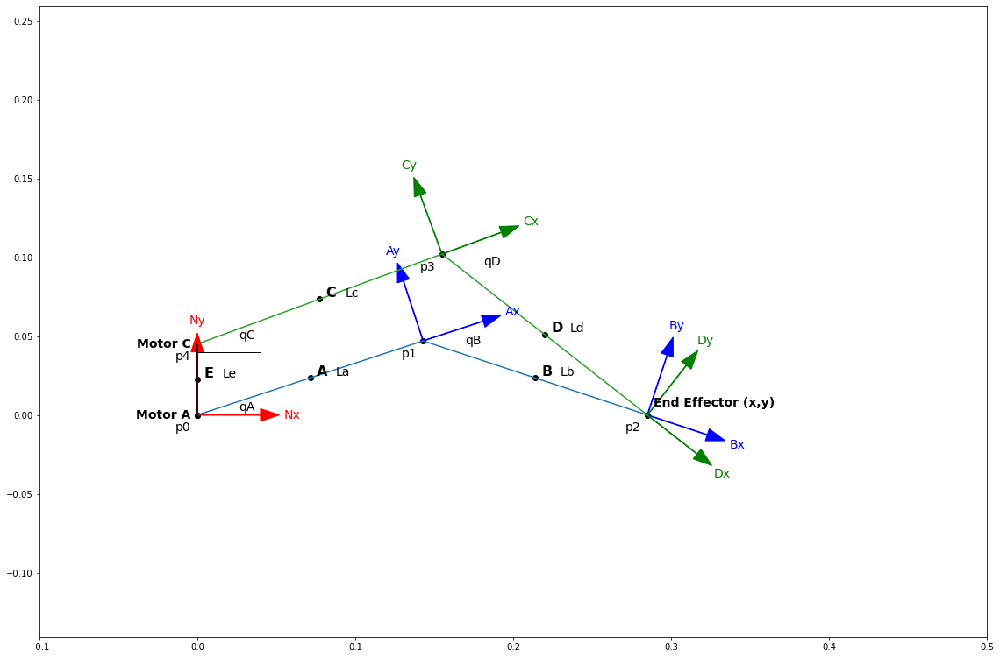
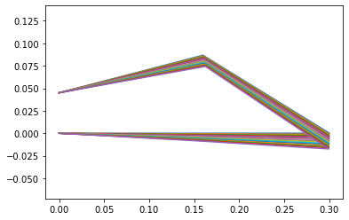

# **Dynamics II Prep**

[Dynamics](DynamicsPage.html)
[Home](index.md)

Zipped folder:

Chris Dyn2

System Kinematics

System Dynamics

2D\_5bar

Wing Assembly, A, B, C, D, E

My tasks this week were to adjust the geometry of the system to increase wing retraction and reduce motor torque requirements and to update our SolidWorks models, and kinematics and dynamics code to reflect the changes in geometry and its effect on the inertial properties. I completed an additional task to set up the cantilever beam analysis for next week when we extract the rest of the parameters from our system. My discussions reference the figure below.

My procedure for adjusting the geometry was to adjust the link lengths in a 2D representation of the wing in solidworks, flap the wing around to analyze the range of motion, then run the new link lengths through the system kinematics code to see the motor torque requirement.

I increased the relative length of link C by 10% so that both top links have the same length. This increased wing retraction, but also increased the required motor torque to over 3 Nm. I then increased the length of the base link E by 50%. This reduced the required motor torque closer to 3 Nm without affecting wing retraction. Lastly, to further reduce motors torques, I decided to scale the entire system down to 75% of its original size, reducing the total wing length to 30cm. This is still within the range of wing sizes for a mallard duck but reduces the required motor torque to 2.2 Nm. This is much more manageable with normal servo motors. The geometry changes are reflected in the table and figure below.

| Link A | 0.15 |
| --- | --- |
| Link B | 0.15 |
| Link C | 0.165 |
| Link D | 0.165 |
| Link E | 0.045 |
| Width | 0.15 |

The next task was to add an angle limiting device such that qB \&lt;= 0deg. This would prevent the bottom arm of the wing from inverting into a convex configuration. We want to keep the wing concave or flat. I designed an attachment to link B that makes contact with link A when the two links are parallel. The initial dimensions of this attachment are shown in the table and figure below. If, during our testing, the device fails, we will adjust its dimensions and update the model and code accordingly.

| Past edge | 0.02 |
| --- | --- |
| Overlap length | 0.04 |
| Width | 0.05 |

My last task was to update the solidworks models and code to reflect the updated geometry and inertial properties. The figure below shows the latest render of our wing prototype. The relative link lengths are slightly adjusted, the overall size is reduced to 75%, and the angle limiter attached to link B is visible in the render.

My teammate was able to acquire the material for our prototype and measure the material&#39;s density. With this density, I was able to measure the mass and inertial properties of each link. The mass and inertial parameters are shown in the tables and figure below.

|
 | m | Ixx | Iyy | Izz |
| --- | --- | --- | --- | --- |
| A | 0.027 | 0.00020264 | 0.00040500 | 0.00020264 |
| B | 0.0306 | 0.00022378 | 0.00042744 | 0.00020422 |
| C | 0.0297 | 0.00022291 | 0.00049228 | 0.00026969 |
| D | 0.0297 | 0.00022291 | 0.00049228 | 0.00026969 |

The angle limiter attachment moves link B&#39;s center of mass from the midpoint of the link, so I also measured the location of the center of mass with respect to a coordinate system I placed at a corner of the link. The center of mass location is shown in the table and figure below.

|
 | x | y | z |
| --- | --- | --- | --- |
| B | 0.06735294 | 0.00247059 | 0.07500000 |

Lastly, I had to update the system kinematics and dynamics code. In the system kinematics code, I updated the position of the wing in the first plot to match the geometry from solidworks. Next, I measured the motor angles of the wing&#39;s fully extended, horizontal position in solidworks and updated the initial values of the optimization problem with those angles. After rerunning the code, I was able to get our new motor torque requirement of 2.22 Nm. In the system dynamics code, I updated the link lengths, link masses, link inertias, and link B&#39;s center of mass location. I reran the code to regenerate plots and animations for b=0 and b=1 cases. The updated force, velocity, and power results and the dynamic simulation are shown in the table and figure below.

| Output Force | [[0.],[-9.81]] |
| --- | --- |
| Input Torque A | -0.00153635774059645 |
| Input Torque C | -2.22720282828635 |
| Output Velocity | [[0.],[-1.25663706]] |
| Input Velocity A | -8.37758040957278 |
| Input Velocity C | -5.52923984101252 |
| Input Power A | 0.0128709605097164 |
| Input Power C | 12.3147386121766 |

One additional task that I did not plan to do but ended up doing was to set up the cantilever beam analysis on link B in solidworks. I used the 844.45 MPa modulus of elasticity for corrugated cardboard from [1] that we will replace with our own measured value next week. The beam deflected just over 10mm under the full load. The deflection result is shown in the figure below.

[Dynamics](DynamicsPage.html)
[Home](index.md)

**References:**

[1] Zoheir Aboura, Nabil Talbi, Samir Allaoui, Malk Benzeggagh. Elastic behavior of corrugated cardboard: Experiments and Modeling. Composite Structures, Elsevier, 2004, 63 (1), pp.53-62. ffhal00636959
